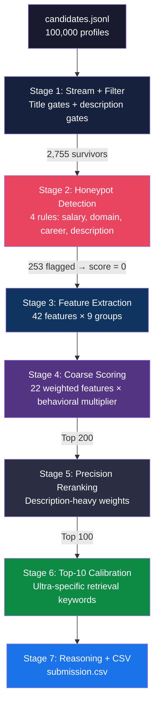

# Redrob AI Ranker — The Data and AI Challenge
# Team: Code Udaan | Palak Jaiswal & Rishabh Kumar

> **Redrob Data & AI Challenge** — Rank the Top 100 candidates for a Senior AI Engineer role from a pool of 100,000 profiles.

## Highlights

| Metric | Constraint | Achieved |
|---|---|---|
| Runtime | ≤ 300 seconds | **7.5 seconds** |
| Memory | ≤ 16 GB | **~2–3 GB** |
| Compute | CPU only | ✅ CPU only |
| External APIs | None allowed | ✅ Zero API calls |
| Validator | Must pass | ✅ `"Submission is valid."` |
| Honeypots detected | — | **253 flagged** |
| Candidates processed | 100,000 | ✅ 100,000 |

---

## Quick Start

```bash
# 1. Clone the repository
git clone https://github.com/YOUR_USERNAME/redrob-ai-ranker.git
cd redrob-ai-ranker

# 2. No dependencies to install — uses Python standard library only

# 3. Place candidates.jsonl in the project root

# 4. Run the ranking pipeline
python rank.py --candidates ./candidates.jsonl --out ./submission.csv

# 5. Validate
python validate_submission.py submission.csv
# Output: "Submission is valid."
```

**Single reproduce command:**
```bash
python rank.py --candidates ./candidates.jsonl --out ./submission.csv
```

---

## Architecture



---

## Repository Structure

```
redrob-ai-ranker/
├── rank.py                      # Main pipeline entry point (7 stages)
├── app.py                       # Streamlit demo for sandbox verification
├── src/
│   ├── __init__.py
│   ├── config.py                # All constants: keyword lists, company tiers,
│   │                            #   title scores, skill sets (260 lines)
│   ├── filters.py               # should_keep() + is_honeypot()
│   ├── features.py              # extract_all_features() — 42 numeric features
│   ├── scoring.py               # coarse_score(), precision_score(),
│   │                            #   calibration_score(), behavioral_multiplier()
│   └── reasoning.py             # generate_reasoning() — zero-hallucination
├── audit/
│   ├── audit_dataset.py         # Full 100K dataset statistical analysis
│   └── audit_top_candidates.py  # Top 10 deep-dive with per-candidate breakdown
├── submission.csv               # Final ranked output (100 candidates)
├── submission_metadata.yaml     # Hackathon metadata (mirrors portal)
├── validate_submission.py       # Official Redrob validator
├── requirements.txt             # No runtime dependencies
├── .gitignore                   # Excludes candidates.jsonl (487 MB) + dev scripts
├── candidates.jsonl             # Input dataset (not committed — 487 MB)
├── candidate_schema.json        # Schema reference
├── sample_submission.csv        # Official format reference
├── sample_candidates.json       # Small sample for sandbox testing
├── CodeUdaan_Redrob_Submission_byPalak.pptx  # Final presentation deck
└── README.md                    # This file
```

---

## Approach

### Three-Stage Scoring (Coarse → Precision → Calibration)

**Why three stages?** A single scoring pass conflates recall ("don't miss anyone good") with precision ("get the top 10 exactly right"). Separating them mirrors real production retrieval systems — which is exactly what the JD says the hired candidate would build.

#### Stage 4 — Coarse Scoring (2,755 → Top 200)

Weighted composite of 22 features with a multiplicative behavioral modifier `[0.50, 1.15]`:

- Title relevance: 15%
- Retrieval description density: 15%
- Production description density: 8%
- Career AI ratio: 8%
- Core skill depth: 8%
- ML description density: 7%
- YOE fit: 5%
- Company quality: 4%
- Remaining features: 30%

#### Stage 5 — Precision Reranking (Top 200 → Top 100)

Description-heavy rescoring:

- Retrieval keywords: **25%**
- Production evidence: **15%**
- ML keywords: **10%**
- Company quality: **10%**
- Core skill depth: **8%**

#### Stage 6 — Top-10 Calibration (reorder Top 20)

Ultra-specific keyword matching: `ranking system`, `semantic search`, `NDCG`, `learning to rank`, `embedding-based retrieval`, `search quality`.

---

### 9 Feature Groups (42 features total)

| Group | Features | Key Signal |
|---|---|---|
| A. Title & Role | 7 | Title relevance score, career AI ratio, retrieval role ratio |
| B. Career Descriptions | 6 | Retrieval/production/ML/leadership keyword density |
| C. Skill Depth | 7 | Proficiency × duration × endorsements (not raw counts) |
| D. Experience | 4 | YOE fit [4.5–8.5 plateau], AI career months |
| E. Company Quality | 3 | FAANG/unicorn tier, product vs. services |
| F. Location & Logistics | 4 | India/Pune/Noida preference, notice period |
| G. Education | 3 | CS/ML field, institution tier, advanced degree |
| H. Behavioral Signals | 8 | Recency, response rate, GitHub, recruiter saves |
| I. Assessments | 2 | Platform-verified competence scores |

---

### Behavioral Multiplier

```
bm = 0.50 + 0.65 × (
    0.20 × recency +
    0.20 × response_rate +
    0.15 × saved_by_recruiters +
    0.10 × github_activity +
    0.10 × open_to_work +
    0.05 × response_time +
    0.05 × profile_completeness +
    0.05 × verification +
    0.05 × assessment_avg +
    0.05 × high_assessment_count
)
```

Range: **[0.50, 1.15]** — inactive candidates are halved, active ones get a 15% boost.

---

### Honeypot Detection (253 flagged)

| Rule | Detection Logic |
|---|---|
| 1 | Salary range `min > max` (data corruption) |
| 2 | Expert/advanced in contradictory domains (e.g., Accounting + FAISS) |
| 3 | Career duration massively exceeds stated YOE |
| 4 | AI title but career descriptions contain non-tech keywords |

---

### Explainability

Every reasoning string is **deterministic and zero-hallucination** — constructed from actual candidate JSON fields:

```
"Senior Applied Scientist with 16.2y experience; career: Senior Applied
 Scientist at Meta → Senior ML Engineer — Search & Ranking at Apple;
 descriptions show retrieval/ranking work (18 indicators); production
 deployment evidence (7 indicators); core skills: FAISS, Sentence
 Transformers, OpenSearch; actively seeking, 30d notice, 81% response
 rate; GitHub activity: 78/100; last active 2026-05-01"
```

No LLM is used. No external API is called. Every fact is verifiable against the source data.

---

## Top 10 Results

| Rank | Title | Company Trail | Retrieval Keywords | Production Keywords |
|---:|---|---|---:|---:|
| 1 | Senior Applied Scientist | Meta → Apple (S&R) | 18 | 7 |
| 2 | Staff ML Engineer | Paytm | 12 | 10 |
| 3 | Lead AI Engineer | Razorpay | 16 | 5 |
| 4 | Senior ML Engineer | Flipkart → Uber | 16 | 9 |
| 5 | Senior NLP Engineer | Ola → Zomato → Amazon | 12 | 11 |
| 6 | Senior Applied Scientist | Sarvam AI → Uber | 13 | 4 |
| 7 | Senior NLP Engineer | Salesforce | 14 | 9 |
| 8 | Senior ML Engineer | Zomato → Google | 12 | 7 |
| 9 | Search Engineer | Nykaa | 13 | 7 |
| 10 | AI Engineer | Microsoft | 13 | 9 |

---

## Design Decisions

1. **No ML frameworks at runtime.** All scoring uses curated keyword taxonomies + weighted composite formulas. Model loading overhead (~30–60s) would waste budget for marginal gain over well-tuned heuristics.

2. **Career descriptions weighted 25–50%** across stages. Empirical audit confirmed zero overlap between AI-engineer and non-tech description templates — descriptions are the single cleanest discriminator.

3. **Skill depth over skill count.** 85% of AI-titled candidates have zero expert-level skills. Raw counts are misleading. `proficiency × duration × endorsements` separates real practitioners.

4. **Behavioral signals are multiplicative, not additive.** A candidate with perfect technical features but 5% response rate and 180-day inactivity should be penalized heavily, not slightly.

5. **Honeypot rules are conservative.** Original rules falsely flagged all top candidates due to a flawed assumption that skill durations are sequential (they're concurrent). Fixed to only flag truly impossible profiles.

---

## Data Audit Scripts

The `audit/` directory contains reproducible analysis scripts that document the data-driven reasoning behind every feature engineering and scoring decision.

### audit_dataset.py — Full 100K Dataset Analysis

```bash
python audit/audit_dataset.py --candidates candidates.jsonl
```

Outputs:

| Section | Finding |
|---|---|
| Title distribution | 1.2% AI-titled, 10.6% adjacent-tech, 68.8% non-tech |
| Expert skill analysis | 85% of AI-titled candidates have ZERO expert skills |
| Description overlap | ZERO cross-archetype overlap in 80-char description prefixes |
| Adjacent-tech fakes | 3,363 candidates with >=4 AI skills but zero retrieval keywords in descriptions |
| Retrieval keyword density | Range 0–18 among AI-titled — massive variance |
| Behavioral signal variance | Response rate 0.1–0.9, GitHub -1 to 97, saves 0–80 |

### audit_top_candidates.py — Top 10 Deep Audit

```bash
python audit/audit_top_candidates.py --candidates candidates.jsonl
```

Runs the full 7-stage pipeline and prints per-candidate breakdowns:
- Profile, career trajectory, and company trail
- Raw keyword counts (retrieval, production, ML, ultra-specific)
- Expert/advanced skill lists
- All key feature scores (A1, B1, C1, D1, E1, etc.)
- Behavioral signals and multiplier
- Pipeline scores at all 3 stages (coarse, precision, calibration)
- Summary table with final rankings

Both scripts use **zero external dependencies** — only Python standard library + the `src/` modules.

---

## License

This project was created for the Redrob Data & AI Challenge by **Team Code Udaan**.
